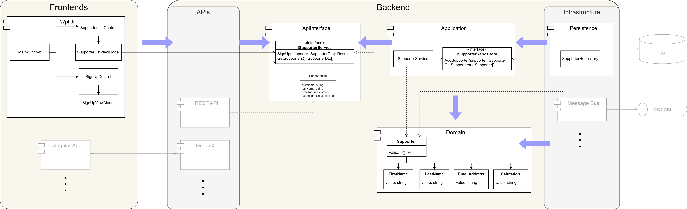

# Support Michael

This project shows some ideas and architectural possibilities I can offer to your project. In this case,
a rich client WPF application which should be maintainable, scalable and testable.

### Requirements

The following user stories are implemented:

- As Michael I'd like to get support so that my acceptance can be determined based on qualitative factors.
- As a team manager I want to see a list of all people who have shown support so that I can decide if we want to have Michael on board.

#### Non-functional requirements

- The application shall be designed for large-scale development in a team with focus on maintainability, scalability and testability
- Work with .NET 8 instead of 9 so that compability on developer machines is easier
- No use of a real database

### Architecture

The architecture supports maintainability, scalability and testability. Therefore, the following projects/layers
are implemented, whereas the overall architecture uses the principles of [onion architecture](https://herbertograca.com/2017/11/16/explicit-architecture-01-ddd-hexagonal-onion-clean-cqrs-how-i-put-it-all-together/). It is depicted
in . The blue arrows mark dependencies corresponding to the onion.

- Domain
  - Focuses on the domain, i.e. business entities and logic
  - Is the only layer where business logic resides
  - Doesn't depend on any other layer
  - Because of the small scope, no further concepts like DDD are used
- Application
  - Contains logic for orchestrating infrastructure and domain layers
  - Uses simple services classes, but other architectural patterns like CQRS can be used instead
- ApiInterface
  - Is a "port" for all external user-driven systems like APIs and frontends
  - Doesn't depend on any other layer
  - It ensures maximum independence between UI and application/domain layers
  - Uses [`System.Reactive`](https://github.com/dotnet/reactive) to push notifications about changes to APIs/frontends
- Persistence
  - Belongs to the infrastructure and depends on the Application to implement interfaces
  - The infrastructure in common handles external systems like databases or a message bus
- WpfUi
  - Displays data and takes user interactions
  - Uses MVVM with the [MVVM Toolkit](https://learn.microsoft.com/en-us/dotnet/communitytoolkit/mvvm/)
- Startup
  - Encapsulates startup wiring and dependency injection

### Testing

Next to a common `UnitTests` projects for all important components, there is also a project `BehaviorTests`. This
uses [reqnroll](https://reqnroll.net/) to enable behavior driven testing in user scenarios with the help of
[Gherkin](https://cucumber.io/docs/gherkin/) syntax.

### Decisions

- To get some feedback when something is supposed to happen, console logging is used.
  - Since there is no native logging inside a WPF app, a console window is also opened when the WPF app starts.
- To ensure some common coding styles, [StyleCop.Analyzers](https://github.com/DotNetAnalyzers/StyleCopAnalyzers) is used with most rules on default.
- Since only the domain should contain business logic, there is no validation in the UI itself. Instead, a result is returned
  which can be interpreted by the UI to display errors. This enables easy integration of other APIs/frontends as well
  as enables the behavior testing strategy.
- No E2E tests (for now).
- XML element documentation is only done for public members of interest. Clean code is preferred over (redundant) comments.
